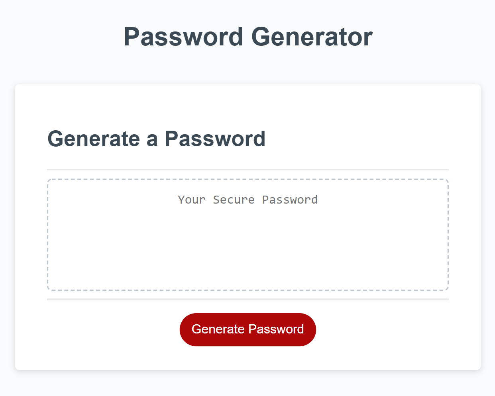

# Password Generator

## Description
* A random password is generated based on criteria provided by the user. The criteria is provided through prompts.

* After clicking the "Generate Password" button, the user is prompted to choose the password length. The answer must be within the range of 8-128. If not, the user will be prompted again until a valit number is provided.

* The user is then prompted to confirm if they would like to include uppercase letters, lowercase letters, numbers, and/or special characters. The use muse select at least one criteria, or they will loop back through the confirm prompts.

* After all parameters have been defined, a random password will be generated inside the password box.

## Technologies Used: HTML, CSS, & JavaScript

## Screenshot

## Link
* [Ronan's Password Generator](https://galv-ronan.github.io/pasword-generator-ronan/)
* [GitHub Link](https://github.com/galv-ronan/pasword-generator-ronan.git)
